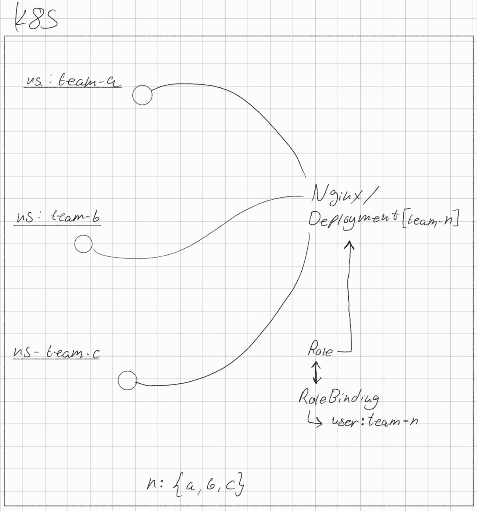

## Train Kubernetes RBAC
The `dev-rbac` Helm Chart create the follwing workflow :





Installl the chart : 
```bash
$ helm install  dev-rbac . --debug
```


```bash
 $ kubectl get ns | grep team
team-a            Active   5m44s
team-b            Active   5m44s
team-c            Active   5m44s
 $ kubectl get all  -A  | grep team | awk '{ print $2 }'
pod/team-a-nginx-59c5849978-v8k4v
pod/team-b-nginx-59c5849978-74fzb
pod/team-c-nginx-59c5849978-h8qkd
deployment.apps/team-a-nginx
deployment.apps/team-b-nginx
deployment.apps/team-c-nginx
replicaset.apps/team-a-nginx-59c5849978
replicaset.apps/team-b-nginx-59c5849978
replicaset.apps/team-c-nginx-59c5849978
```
Check authorization with kubectl --as[USER]
```bash
 ../authorisation.sh  
+ users=("team-a" "team-b" "team-c")
+ for user in '"${users[@]}"'
+ for ns in '"${users[@]}"'
+ kubectl get pods --as=team-a -n team-a
NAME                            READY   STATUS    RESTARTS   AGE
team-a-nginx-59c5849978-d8l28   1/1     Running   0          12h
+ for ns in '"${users[@]}"'
+ kubectl get pods --as=team-a -n team-b
Error from server (Forbidden): pods is forbidden: User "team-a" cannot list resource "pods" in API group "" in the namespace "team-b"
+ for ns in '"${users[@]}"'
+ kubectl get pods --as=team-a -n team-c
Error from server (Forbidden): pods is forbidden: User "team-a" cannot list resource "pods" in API group "" in the namespace "team-c"
+ for user in '"${users[@]}"'
+ for ns in '"${users[@]}"'
+ kubectl get pods --as=team-b -n team-a
Error from server (Forbidden): pods is forbidden: User "team-b" cannot list resource "pods" in API group "" in the namespace "team-a"
+ for ns in '"${users[@]}"'
+ kubectl get pods --as=team-b -n team-b
NAME                            READY   STATUS    RESTARTS   AGE
team-b-nginx-59c5849978-zqckj   1/1     Running   0          12h
+ for ns in '"${users[@]}"'
+ kubectl get pods --as=team-b -n team-c
Error from server (Forbidden): pods is forbidden: User "team-b" cannot list resource "pods" in API group "" in the namespace "team-c"
+ for user in '"${users[@]}"'
+ for ns in '"${users[@]}"'
+ kubectl get pods --as=team-c -n team-a
Error from server (Forbidden): pods is forbidden: User "team-c" cannot list resource "pods" in API group "" in the namespace "team-a"
+ for ns in '"${users[@]}"'
+ kubectl get pods --as=team-c -n team-b
Error from server (Forbidden): pods is forbidden: User "team-c" cannot list resource "pods" in API group "" in the namespace "team-b"
+ for ns in '"${users[@]}"'
+ kubectl get pods --as=team-c -n team-c
NAME                            READY   STATUS    RESTARTS   AGE
team-c-nginx-59c5849978-nzv6b   1/1     Running   0          12h
```


